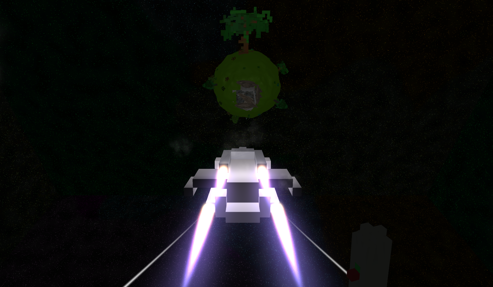

# Ludum Dare 38 Mission: Delta-8x34

You are landed on the micro planet “Delta-8X34”. Your mission: Find and repair a broken antenna for military purposes.   
This was once an old military base. After the war of the chicken, this base was empty but since 4 days the contact to an observation antenna is lost.
